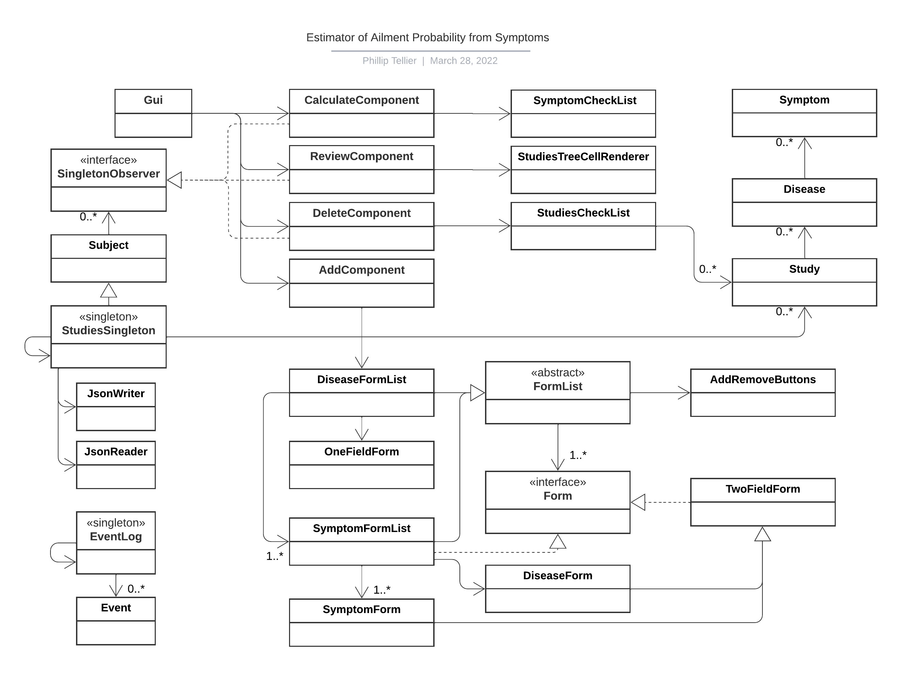

# Disease Probability Estimator 🩺

## What is it? 🤔

This java program generates the probability that a person has various diseases
(*e.g.* Cold, Flu, Strep Throat) depending on the study data available to 
the program. For each study of a group of diseases, the data is a list of 
symptoms for each disease and the number of people with each disease having
each symptom. Multiple studies for different diseases can be added to the 
program to increase the number of diseases to estimate probability for. 

## Target Audience 🎯

Patients 👩‍👧‍👦- Members of the public with symptoms can use the program to better
understand what ailment they might be suffering from. They can enter their 
symptoms into the program in order to receive disease probabilities.

Doctors 👩🏽‍⚕️ - Physicians can update the diseases and symptoms checked by
entering more study data into the program. They can also use the program
to check disease probabilities of their patients.

## Inspiration ✨

This project is inspired by long wait times to see doctors due to a doctor shortage in
Canada and many other countries. The idea of letting more patients receive prompt
medical advice is exciting!

## Example Study Data 📊

Study #1 - 3000 participants tested for cold, flu, strep throat. 
1211 tested positive for a cold, 921 tested positive for the flu, and 1100
tested positive for strep throat.

| Disease     | Symptom     |Probability|
| ----------- | ----------- |:---------:|
| Cold        | -           | 1211/3000|
|             | cough       | 954/1211|
|             | runny nose  | 933/1211|
|             | fever       |  32/1211|
|             | sore throat | 121/1211|
| Flu         | -           | 921/3000|
|             | cough       | 543/921|
|             | runny nose  | 347/921|
|             | fever       | 827/921|
|             | sore throat |  45/921|
| Strep Throat| -           | 1100/3000|
|             | cough       | 789/1100|
|             | runny nose  | 835/1100|
|             | fever       | 743/1100|
|             | sore throat | 967/1100|

## User Stories ‍🎤

### Patients 👩‍👧‍👦

- As a user, I want to be able to enter my symptoms and get the
  probability that I have different illnesses.

### Doctors 👩🏽‍⚕

- As a user, I want to be able to enter the symptoms of my patients and get
  the probability that I have different illnesses.
- As a user, I want to be able to add a study about a group of diseases and 
their symptoms to the program data.
- As a user, I want to be able to delete the data for the studies in the 
program
- As a user, I want to be able to see a summary of the probability data
entered into the program.
- As a user, I want to be able to save my study data to file
- As a user, I want to be able to be able to load my study data from file 

## Simplifying Assumptions for this Program ⚠️

- The disease groups from each study do not have diseases in common.
- The probabilities for diseases from different studies are independent.

## Logging Output
Example of events during addition/ subtraction of the study data that are 
logged to console when exiting the program:

Sun Mar 27 21:14:16 PDT 2022  
added Study with [Gonorrhea, Chlamydia]  
Sun Mar 27 21:19:06 PDT 2022  
removed study with [Flu, Cold]  
Sun Mar 27 21:19:06 PDT 2022  
removed study with [Chron's Disease, Ulcerative Colitis, Giardia]  

## UML Class Diagram
The program's UML class diagram indicates a reasonable amount of coupling between classes; 
there are only necessary relationships between classes. Although the cluster in the diagram 
that begins with "DiseaseFormList" is more convoluted, it is necessary given the nature
of the problem

